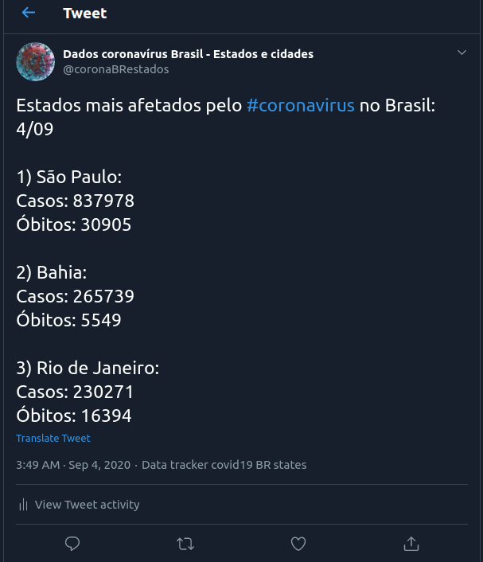

# Twitter bot Covid-19 Brasil

Esse bot tweeta diariamente informações sobre o número de casos e óbitos relacionados ao coronavírus nas principais regiões, estados e cidades do Brasil.

Além disso, ele também responde a menções caso você deseje saber os dados de uma cidade específica.

## APIs consumidas

- Brasil IO:
    - [Site oficial](https://brasil.io/covid19/)
    - [Github](https://github.com/turicas/brasil.io)
    - [API](https://brasil.io/api/dataset/covid19/caso/data/)
- Site oficial do governo
    - Não é divulgada uma API oficial, mas inspecionando o site é possível achar os breakpoints o governo federal usa. Preferi optar por eles como forma principal de obter os dados ao invés do Brasil IO pois eles são atualizados mais rapidamente, e a intenção é que o bot faça tweets diários sobre os dados do mesmo dia.
    - [Dados dos estados](https://xx9p7hp1p7.execute-api.us-east-1.amazonaws.com/prod/PortalEstado)
    - [Dados por região](https://xx9p7hp1p7.execute-api.us-east-1.amazonaws.com/prod/PortalSintese)

## Organização dos posts

### Brasil

- Número de casos e óbitos dos 3 estados com maior número de casos no país

### Região

- Para cada região é publicada uma thread com todos os estados que ela possui
- Número de casos e óbitos da região e dos 3 estados com maior número de casos

### Estado e cidades

- Número de casos e óbitos do estado e das 3 cidades com maior número de casos no respectivo estado.

